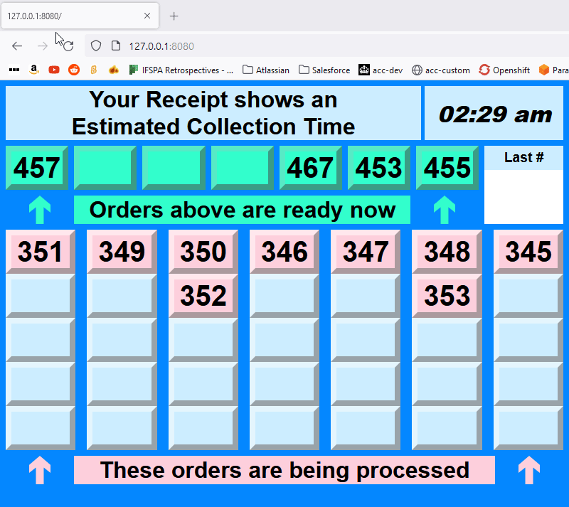

# react-argos



## how to

Use the `/repo/react-argos` folder for just the component itself

### run the demo

To run the demo (stored in `/repo/react-argos-demo`)...

```sh
# From the root of the repositotry...
npm i
npm run turbo demo
```

| Description | URL                               |
| ----------- | --------------------------------- |
| Argos       | http://127.0.0.1:8080/            |
| Dashboard   | http://127.0.0.1:8080/#/dashboard |

### build the demo

```sh
npm i
npm run turbo build
# Push the `/repo/react-argos-demo/dist` folder to GitHub Pages or whatever
```
